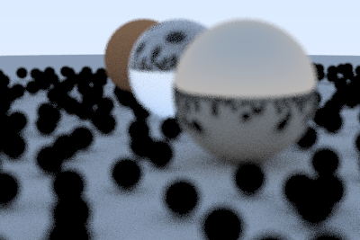
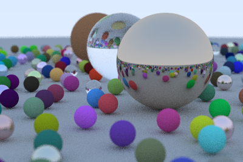

<a id="fr">

<div align=center>
    <a href="#en">EN</a> . 
    <a href="#fr">FR</a>

# Vibe Tracing

*Un programme de ray tracing en C - créé en une seule journée!*
---
</div>

Dans ce **projet éducatif**, nous avons été mis au défi de créer un **programme complet de ray tracing en C** en une seule journée grâce à la collaboration avec des agents IA (vibe coding).

Le ray tracing est un classique de l'infographie qui produit des visuels de haute qualité, ce qui en fait un test idéal du vibe coding. Ce projet montre comment collaborer efficacement avec les agents de codage IA pour construire une application graphique 3D ambitieuse sous des contraintes de temps strictes. 

C'était le défi du **jour 3** de MiniVibes - un projet éducatif créé par notre école de formation. *Pour plus de détails, voir le brief complet du projet (FR & EN) [MiniVibesConsigne.md](./docs/MiniVibesConsigne.md)*

## Qu'est-ce que le vibe coding? Pourquoi?

Le « vibe coding » fait référence à la nouvelle compétence qui consiste à travailler efficacement avec des agents de codage IA. À mesure que les agents IA deviennent plus performants, savoir comment les prompter, les guider et collaborer avec eux devient sans doute une compétence importante, au même titre que les compétences traditionnelles en codage.

## Contraintes du projet

Le défi MiniVibes fonctionnait sous des contraintes strictes:
- **temps limité**: un jour par projet
- **jetons limités**: utilisation de modèles "mini" (multiplicateur 0,33x) la plupart du temps
- **budget limité**: une demande premium par projet/jour

Malgré ces limitations, l'objectif était de créer des projets riches en fonctionnalités et de qualité production qui démontrent les compétences en ingénierie de prompts et en communication avec les agents.

## Autres exigences du projet

- **spécifications complètes du projet avant le développement** - nous avons généré une grande partie avec un LLM (Gemini)
- **contrôle de version basé sur git avec commits intelligents** - nous fournissons des instructions à Copilot dans [`COPILOT.md`](./COPILOT.md)
- **prompting transparent** - tous les prompts documentés dans [`SESSION.md`](./SESSION.md) avec horodatages
- **code initial généré entièrement par les agents IA** - nous avons uniquement écrit ou modifié la documentation, sinon nous avons juste envoyé des prompts!

## Résultat final


**Détails de la scène:**
- résolution: 1200×800 pixels
- échantillons par pixel: 500 (antialiasing)
- profondeur de rebond: 50 (illumination globale)
- temps de rendu: 27 minutes (OpenMP 12 cœurs) vs 119 minutes (séquentiel)
- total de rayons tracés: 960 millions

Le rendu final montre:
- **sphère de verre** (centre) avec réfraction exacte et approximation de Fresnel de Schlick
- **sphère de métal** (droite) avec réflexions spéculaires parfaites
- **sphère mate** (arrière-gauche) avec ombrage diffus Lambertian
- **~480 objets aléatoires**: mélange de matériaux diffus, métalliques et vitrés
- **profondeur de champ**: premier plan et arrière-plan flous, plan médian net
- **illumination globale**: saignement de couleur provenant des objets environnants sur le sol

Réalisé avec 8 prompts au total [*voir `SESSION.md`*](./SESSION.md)

## Structure du projet

```
vibe-tracing/
├── README.md                # ce fichier
├── LICENSE                  # licence du projet
├── COPILOT.md               # instructions pour l'agent
├── SESSION.md               # journal de session
├── Makefile                 # système de compilation
├── docs/
│   ├── Specification.md     # spécification technique du projet
│   └── MiniVibesConsigne.md # aperçu du projet élargi
│   └── *.png                # images
├── src/
│   ├── main.c               # point d'entrée et boucle de rendu
│   ├── ray.h/c              # définition et manipulation des rayons
│   ├── vec3.h/c             # mathématiques vectorielles 3D (+ RNG thread-safe)
│   ├── camera.h/c           # caméra avec look-at et DOF
│   ├── hittable.h/c         # interface abstraite pour les objets
│   ├── sphere.h/c           # implémentation de la sphère
│   ├── material.h/c         # système de scatter (Lambertian, Metal, Dielectric)
│   └── utils.h              # constantes et utilitaires
├── tests/                   # tests unitaires (48 tests, tous passants)
│   ├── test_vec3.c          # opérations vectorielles (13 tests)
│   ├── test_ray.c           # opérations sur les rayons (6 tests)
│   ├── test_sphere.c        # intersection rayon-sphère (9 tests)
│   ├── test_material.c      # fonctions de scatter des matériaux (8 tests)
│   └── test_camera.c        # logique de la caméra (12 tests)
├── output/                  # images rendues (.ppm et .png)
└── .gitignore               # fichiers ignorés (binaires, images générées)
```

### Caractéristiques techniques

- **Architecture modulaire**: Une responsabilité par module (séparation claire des préoccupations)
- **Interfaces de fonction**: Polymorphisme en C via pointeurs de fonction
- **Path tracing**: Récursion jusqu'à MAX_DEPTH=50, échantillonnage Monte Carlo
- **Antialiasing MSAA**: 500 échantillons par pixel pour qualité élevée
- **Matériaux**: Lambertian (diffus), Metal (spéculaire), Dielectric (verre avec loi de Snell + Fresnel de Schlick)
- **Parallélisation OpenMP**: Rendu multi-cœur avec graines RNG uniques par thread
- **Optimisations**: -O3, inline pour les chemins chauds en math, buffer pixels pour I/O thread-safe

### Améliorations des performances avec le multithreading

Rendu 1200×800 @ 500spp, MAX_DEPTH=50 (960 millions de rayons):
- **OpenMP (12 cœurs)**: 27 minutes
- **Séquentiel**: 119 minutes
- **Accélération**: ~4.4×

## Débogage, optimisation et test (utilisation du requête premium)

Selon les exigences du projet, nous ne pouvions utiliser qu'**une seule** requête premium par projet/jour, que nous avons décidé d'utiliser pour les tests et le débogage à la fin.

Vous trouverez ci-dessous les rendus avant et après créés au cours de ce processus.

<div align=center>
          
    
<p>rendu avant débogage & optimisation  --->  rendu après débogage & optimisation</p>
</div>

## Compétences

Ce projet démontre:
- **compétences de collaboration IA** - de plus en plus appréciées dans les entretiens techniques et les rôles
- **développement rapide** - construire des fonctionnalités complètes sous contraintes
- **pratiques de codage propre** - workflow Git approprié et organisation du code
- **ingénierie de prompts** - une compétence technique pratique et émergente
- **gestion du temps** - livrer un travail de qualité dans des délais stricts

## Références sur le Ray Tracing

Les concepts logiques et les algorithmes de ce projet sont basés sur les fondamentaux fournis par la série de livres "Ray Tracing in One Weekend".

**Auteurs**: Peter Shirley, Trevor David Black, Steve Hollasch.

**Titre de la série**: Ray Tracing in One Weekend Series (v4.0.2).

**URL:** https://raytracing.github.io/

---

<a id="en">

<div align=center>
    <a href="#en">EN</a> . 
    <a href="#fr">FR</a>

# Vibe Tracing

*A ray tracing program in C - built in only one day!*
---
</div>

In this **educational project** we were challenged to create a **complete ray tracing program in C** in a single day through AI agent collaboration (vibe coding). 

Ray tracing is a classic in computer graphics that produces high-quality visual output, making it an ideal test of vibe coding. This project showcases how to collaborate effectively with AI coding agents to build an ambitious 3D graphics application under strict time constraints. 

It was the **day 3** challenge of MiniVibes - an educational project set by our training school. *For more details, see complete project brief (French & English) [MiniVibesConsigne.md](./docs/MiniVibesConsigne.md)*

## What is vibe coding? Why? 

Vibe coding refers to the emerging skill of effectively working with AI coding agents. As AI agents are becoming more capable, knowing how to prompt, guide, and collaborate with AI coding agents is perhaps becoming an important skill. One that sits alongside traditional coding skills.

## Project constraints

The MiniVibes challenge operated under strict constraints:
- **limited time**: one day per project
- **limited tokens**: using "mini" models (0.33x multiplier) most of the time  
- **limited budget**: one premium request per project/day

Despite these limitations, the idea was to create feature-rich, production-quality projects that demonstrate prompt engineering and agent communication skills. 

## Other project requirements

- **complete project specifications before development** - we generated much of this with an LLM (Gemini) too
- **git-based version control with intelligent commits** - we provide instructions to Copilot in [`COPILOT.md`](./COPILOT.md)
- **transparent prompting** - all prompts documented in [`SESSION.md`](./SESSION.md) with timestamps
- **initial code generated entirely by AI agents** - we only wrote or edited the documentation, otherwise we just prompted!

## Final output


**Scene details:**
- resolution: 1200×800 pixels
- samples per pixel: 500 (antialiasing)
- bounce depth: 50 (global illumination)
- render time: 27 minutes (12-core OpenMP) vs 119 minutes (sequential)
- total ray traces: 960 million

The final render showcases:
- **glass sphere** (center) with accurate refraction and Schlick's fresnel approximation
- **metal sphere** (right) with perfect specular reflections
- **matte sphere** (back-left) with Lambertian diffuse shading
- **~480 random objects**: mix of diffuse, metallic, and glass materials
- **depth of field**: foreground and background blurred, midground sharp
- **global illumination**: color bleeding from surrounding objects onto the ground plane

Achevied with 8 total prompts [*see `SESSION.md`*](./SESSION.md)

## Project structure

```
vibe-tracing/
├── README.md                # this file
├── LICENSE                  # project license
├── COPILOT.md               # agent instructions
├── SESSION.md               # session log
├── Makefile                 # build system
├── docs/
│   ├── Specification.md     # technical project specification
│   └── MiniVibesConsigne.md # larger project overview
│   └── *.png                # images
├── src/
│   ├── main.c               # entry point and render loop
│   ├── ray.h/c              # ray definition and manipulation
│   ├── vec3.h/c             # 3D vector math (+ thread-safe RNG)
│   ├── camera.h/c           # camera with look-at and DOF
│   ├── hittable.h/c         # abstract interface for objects
│   ├── sphere.h/c           # sphere implementation
│   ├── material.h/c         # scatter system (Lambertian, Metal, Dielectric)
│   └── utils.h              # constants and utilities
├── tests/                   # unit tests (48 tests, all passing)
│   ├── test_vec3.c          # vector operations (13 tests)
│   ├── test_ray.c           # ray operations (6 tests)
│   ├── test_sphere.c        # ray-sphere intersection (9 tests)
│   ├── test_material.c      # material scatter functions (8 tests)
│   └── test_camera.c        # camera logic (12 tests)
├── output/                  # rendered images (.ppm and .png)
└── .gitignore               # ignored files (binaries, generated images)
```

### Technical features

- **Modular architecture**: single responsibility principle; clear separation of concerns
- **Function pointers**: C polymorphism for scatter behavior and hittable interface
- **Path tracing**: recursive ray bouncing up to MAX_DEPTH=50 with Monte Carlo sampling
- **MSAA antialiasing**: 500 samples per pixel for high-quality output
- **Materials**: Lambertian (diffuse), Metal (specular with fuzz), Dielectric (glass with Snell's law + Schlick's fresnel)
- **OpenMP parallelization**: multi-core rendering with unique per-thread RNG seeds
- **Optimizations**: -O3 compilation, inline math hot-path, pixel buffer for thread-safe I/O

### Performance improvements made with multithreading

Render 1200×800 @ 500spp, MAX_DEPTH=50 (960 million ray traces):
- **OpenMP (12 threads)**: 27 minutes
- **Sequential**: 119 minutes  
- **Speedup**: ~4.4×

## Debugging, optimizing & testing (using premium token)

As per the project requirements, we could use **only one** premium request per project/day which we decided to use for testing and debugging at the end. 

Below are the before and after renders created during this process. 

<div align=center>
          
    
<p>render before debugging & optimization  --->  render after debugging & optimization</p>
</div>

## Skills

This project demonstrates:
- **AI collaboration skills** - increasingly valued in tech interviews and roles
- **rapid development** - building complete features under constraints
- **clean coding practices** - proper Git workflow and code organization
- **prompt engineering** - a practical, emerging technical skill
- **time management** - delivering quality work within strict timeframes

## References

The specification logic and algorithms in this project were based on the foundational concepts provided in the "Ray Tracing in One Weekend" book series. 

**authors**: Peter Shirley, Trevor David Black, Steve Hollasch.

**series title**: Ray Tracing in One Weekend Series (v4.0.2).

**URL:** https://raytracing.github.io/

---

